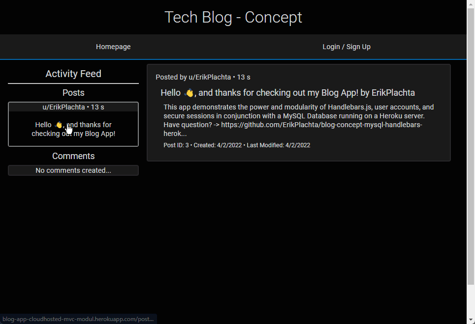

# Blog Concept App

Hello 👋🏼, and thanks for checking out my Blog concept app!

I've built to demonstrate the power and modularity of Handlebars.js, user account
creation, and secure user sessions in conjunction with a MySQL database running
on a Heroku server.

## Framework

- JawsDB Hosting MySQL Database
- Sequelize as the ORM
- Node/Express Server [running on Heroku](https://blog-app-cloudhosted-mvc-modul.herokuapp.com/)
- Handlebars.js templates to build modular content

## Usage

- Users can sign in or create new account
- Users can Post or Delete their own Comments
- Users can view Homepage to see a running log of ALL Comments and Replies
- Users have their own Dashboard page with stats
- Users Post or Delete their own Replies to Comments
- If a Comment with Replies is Deleted, all Replies are also Deleted no matter their owner

## 👇🏼 **Try it Out**

> This is a link to to the live app.

[ErikPlachta/Blog-Concept-App](https://blog-app-cloudhosted-mvc-modul.herokuapp.com/)

---

### A Demo Gif

> This giphy demonstrates all features.

---

## Created by [Erik Plachta](https://www.github.com/erikplachta)

See [my portfolio here](https://erikplachta.com), to get in touch or learn more about my work.
